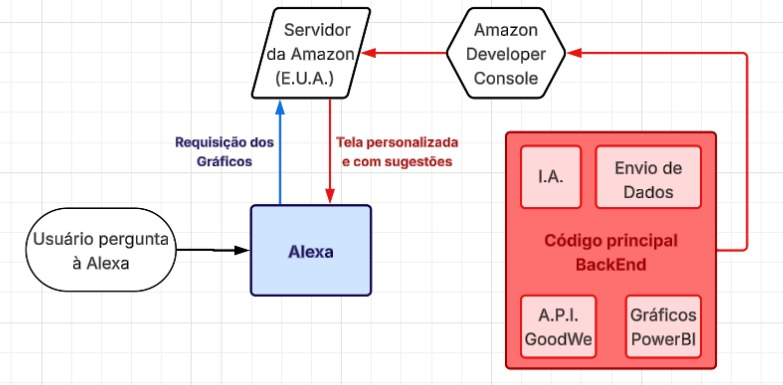

# 🔋 Challenge FIAP 2025 – Integração Alexa + GoodWe

Projeto acadêmico desenvolvido para o curso de Ciência da Computação - 1º semestre da FIAP, com o objetivo de integrar a assistente virtual Alexa à API da empresa GoodWe.

Por meio dessa integração, o usuário poderá acessar visualmente, pela própria Alexa, informações úteis sobre sua bateria, consumo de energia e sugestões personalizadas de economia.

---

## 🎯 Objetivo

Fazer com que o usuário tenha **melhor controle e acesso facilitado** às informações de sua bateria e casa conectada, usando uma interface prática e acessível via Alexa.

---

## 💡 Por que Alexa?

A Alexa foi escolhida como meio de interface por ser uma tecnologia amplamente adotada, acessível e de fácil integração visual, eliminando a necessidade de instalar apps próprios ou acessar sites específicos. Além disso, a faculdade exigiu o uso de assistentes virtuais no desafio.

---

## ⚙️ Tecnologias envolvidas

| Tecnologia        | Finalidade                                 |
|------------------|---------------------------------------------|
| Python           | Backend e lógica de requisição              |
| Java             | Comunicação com a API da GoodWe             |
| JavaScript       | Skill de integração com a Alexa             |
| APL (Alexa Presentation Language) | Apresentação visual na Alexa |

---

## 🧠 O que o projeto pretende oferecer

- Visualização do nível e status das baterias conectadas
- Sugestões de economia de energia com base no uso
- Recomendações de horários ideais para carregar veículos elétricos
- Integração simples e direta com dispositivos Alexa

---

## 🧭 Fluxo de funcionamento (protótipo)

> 💡 Substitua o caminho abaixo com a imagem real do seu fluxograma quando for adicionar ao repositório.

---

## 👨‍💻 Integrantes

- Bento Donato Garcia  
- Fernando Pimentel Soriano  
- João Victor Alves de Abreu  
- Lucas Franco de Godoy Fortes  
- Luiz Henrique Macedo Graça

---

## 📌 Status

🧪 Este projeto está em estágio inicial de prototipagem e validação de conceito.

---

## 📄 Licença

Este projeto é de uso educacional, desenvolvido para fins acadêmicos na FIAP.
